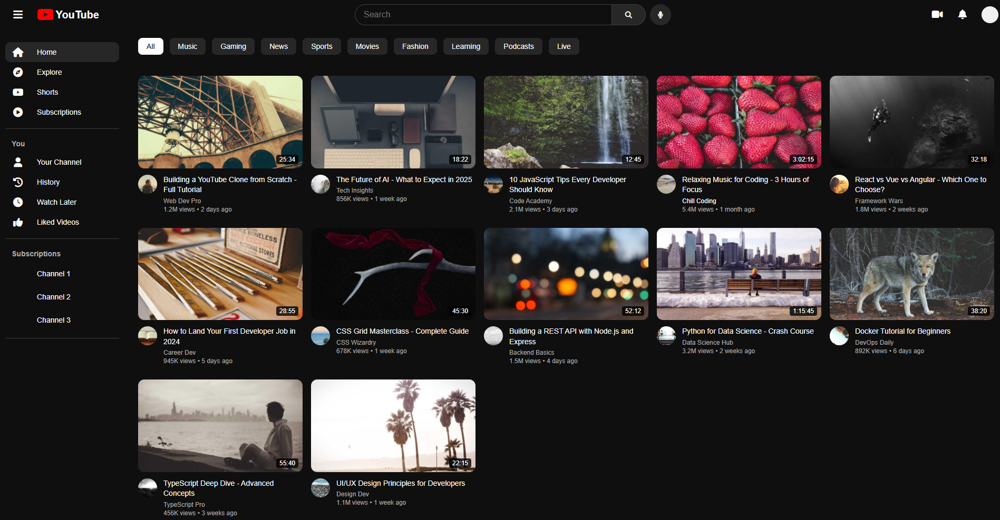
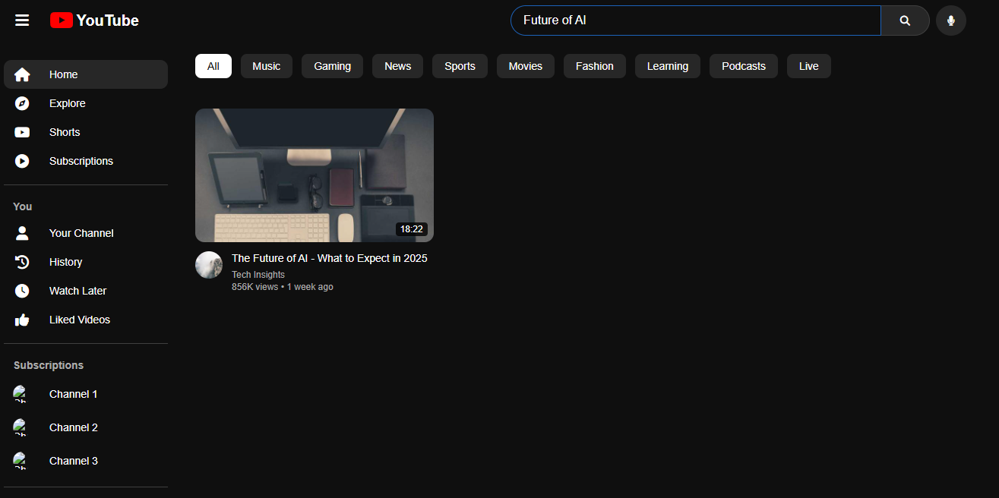
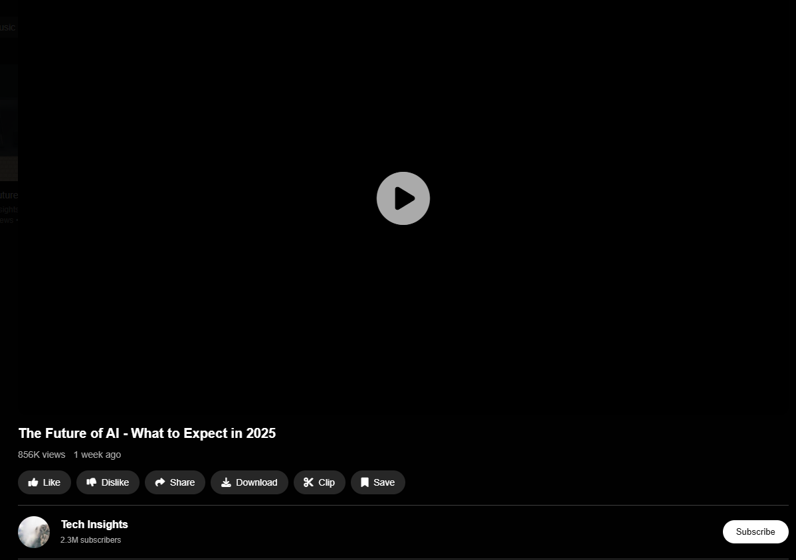

# 🎬 YouTube Clone App

A responsive **YouTube UI Clone** built using **HTML, CSS, and Vanilla JavaScript**.  
This project replicates the modern YouTube front-end design and core interactions to practice real-world front-end development concepts.

---

## 🚀 Features

- Responsive video grid layout  
- Collapsible sidebar navigation  
- Search functionality (real-time filtering)  
- Category filter chips  
- Video modal with details (title, views, channel, description)  
- Subscribe / Subscribed button toggle  
- Keyboard shortcuts:
  - `Esc` → Close video modal  
  - `/` → Focus search bar  

---

## 🛠️ Tech Stack

- **HTML5** – Structure  
- **CSS3** – Styling & responsiveness  
- **JavaScript (ES6)** – Interactivity & DOM manipulation  

---

## 📂 Project Structure

YouTube-Clone-App/
│
├── index.html # Main HTML structure
├── style.css # Styling and responsive design
├── script.js # JavaScript logic and interactions
└── README.md # Project documentation

## 📸 Screenshots

### 🏠 Homepage

### 🔍 Search

### ▶️ Video Player

